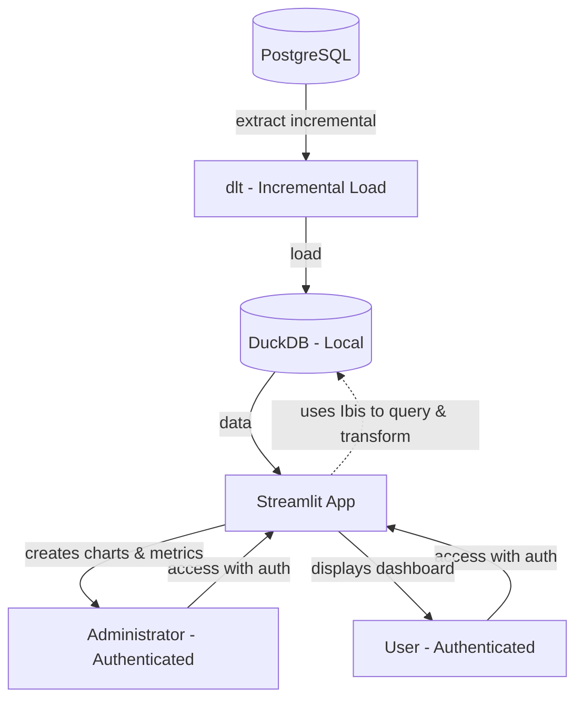

# Visão Geral do Projeto
O objetivo deste projeto é construir uma plataforma de analytics interna modular, flexível e segura utilizando o padrão *Modern Data Stack in a Box*. O ecossistema fornece um backend padronizado para ingestão, segurança, telemetria automatizada e governança de dados, delegando ao Administrador (desenvolvedor Python) total liberdade para realizar engenharia de dados e modelagem estatística livre por meio de contratos de dados fortemente tipados.

# Decisões de Arquitetura e Stack Tecnológica

- **Banco de Dados Operacional (Origem):** PostgreSQL
- **Ingestão dos Dados (EL):** `dlt` (Data Load Tool) com cargas incrementais (Upsert e Append) via timestamp (`updated_at`)
- **Motor Analítico, Logs e Armazenamento Central (Destino):** DuckDB (Arquivo `.duckdb` no mesmo ambiente do Streamlit)
- **Camada de Transformação de Dados:** `Ibis` (Framework Python para consultas analíticas direto dentro do DuckDB)
- **Interface e Servidor Web:** Streamlit distribuído via protocolo HTTP protegido
- **Segurança e Autenticação:** `streamlit-authenticator` com controle de acesso baseado em perfis (RBAC)
- **Integração de Machine Learning:** Padronização agnóstica via contratos baseados em `dataclasses` do Python
- **Observabilidade e Telemetria:** Decoradores Python (`decorators`) injetando logs semi-estruturados nativamente em tabelas com suporte a dados `JSON` no DuckDB
- **Camada de IA Futura:** Chatbot RAG (Data Agent / Text-to-SQL) utilizando `LangChain`/`LlamaIndex`

# Contrato de Dados e Governança de Machine Learning (Dataclasses)
Para suportar painéis complexos que utilizam múltiplos modelos estatísticos simultaneamente de forma flexível, a comunicação entre o pipeline do Administrador e a interface do Streamlit é padronizada através do objeto encapsulador `ModelResult`. A integração dos modelos nos charts é de responsabilidade do Administrador durante a criação dos charts.

**Especialização de Métricas por Tarefa:** A arquitetura reconhece que diferentes abordagens de modelagem exigem indicadores distintos. O ecossistema divide as métricas em três estruturas imutáveis (`frozen=True`):
- **Regressão (`RegressionMetrics`):** Captura métricas contínuas como $R²$, MAE e RMSE.
- **Classificação (`ClassificationMetrics`):** Captura métricas de avaliação binária ou multiclasse como Acurácia, F1-Score, AUC-ROC, Precisão e Recall.
- **Clusterização (`ClusterMetrics`):** Captura métricas de agrupamento como *Silhouette Score*, número total de partições e volumetria de dados para cluster.

**A Estrutura Unificada (`ModelResult`):** Cada modelo instanciado pelo Administrador gera de forma independente a sua própria dataclass contendo:
- **Metadados de Identificação:** Nome do modelo, tipo de tarefa, features utilizadas e hiperparâmetros.
- **Mecanismo de Guardrail:** O limite de tolerância técnica (`minimum_threshold`) e o veredito de segurança calculado pelo backend (`pass_guardrail`).
- **Payload de Métricas:** A dataclass específica acoplada ao resultado.

Se um dashboard utilizar 3 modelos simultâneos, o Administrador passará um conjunto de 3 estruturas `ModelResult` distintas para o ecossistema.

**Comportamento do Componente Visual no Streamlit:** A interface gráfica lê dinamicamente a estrutura de cada `ModelResult`:
- **Se o Guardrail falhar:** Se os filtros aplicados na tela pelo usuário degradarem o poder estatístico do modelo abaixo do limite, o Streamlit exibe um alerta sobre a baixa confiança do modelo.

**Exemplo:**

```python
from dataclasses import dataclass, field
from typing import Any, Literal


@dataclass(frozen=True)
class RegressionMetrics:
    r2: float
    mae: float  # Mean Absolute Error
    rmse: float  # Root Mean Squared Error
    model_type: str = "Regression"


@dataclass(frozen=True)
class ClassificationMetrics:
    accuracy: float
    f1_score: float
    auc_roc: float
    precision: float
    recall: float
    model_type: str = "Classification"


@dataclass(frozen=True)
class ClusterMetrics:
    silhouette: float
    num_clusters: int
    clusters_size: dict[int, int]  # Ex: {0: 150, 1: 340}
    model_type: "Cluster"


@dataclass(frozen=True)
class ModelResult:
    model_id: str  # Nome do modelo para controle de versão
    model_name: str  # Ex: K-Means, Logistic Regression, XGBoost Regressor
    minimum_threshold: float  # Limite para guardrail aceitar o modelo, Admin irá definir
    pass_guardrail: bool  # Calculado pelo backend, o Admin define a métrica principal que será validada
    trained_model: Any  # O objeto do modelo (Booster, Sklearn)
    metrics: RegressionMetrics | ClassificationMetrics | ClusterMetrics
    # Metadados opcionais
    features: list[str] = field(default_factory=list)
    hyperparameters: dict[str, Any] = field(default_factory=dict)
```

# Fluxo de Dados e Pipeline



1. **Extração e Carga (dlt):** O `dlt` se conecta ao PostgreSQL e transfere novos dados para o DuckDB local.
2. **Processamento em Memória (DuckDB + Ibis):** O DuckDB armazena os dados em formato colunar de alta performance. O `Ibis` executa consultas e agregações direto no DuckDB usando sintaxe Python, com avaliação preguiçosa (*lazy evaluation*).
3. **Consumo de Interface (Streamlit)** O Streamlit renderiza os dados transformados pelo Ibis em forma de gráficos (`Plotly`) e tabelas.

# Justificativa das Decisões Técnicas

**Por que dlt e não ADBC Puro?**
- **Cargas Incrementais Nativas:** O `dlt` gerencia o estado da replicação automaticamente através de colunas de controle (ex: `update_at`). O ADBC exigiria lógica manual de controle.
- **Resiliência:** O `dlt` possui evolução automática de esquema. Se o banco PostgreSQL sofrer alterações de colunas, o arquivo DuckDB se adapta sem quebrar o pipeline.
- **Uso Otimizado:** O `dlt` utiliza o ecossistema Apache Arrow sob o capô, garantindo velocidades massivas de ingestão parecidas com o ADBC.

**Por que Ibis para a Modelagem?**
- **Legibilidade e Manutenção:** Permite que o Administrador construa agregações complexas, tabelas fato e dimensões usando Python puro, evitando blocos gigantescos de código SQL dentro do Streamlit.
- **Performance:** O Ibis não carrega o banco na memória RAM do servidor. Ele traduz os comandos em queries nativas executadas com a velocidade de hardware do DuckDB.

# Estrutura do Sistema de Páginas e Controle de Acesso
O acesso ao painel será restrito através do `streamlit-authenticator` via tokens em cookies de sessão e senhas criptografadas em hashes (*bcrypt*). O isolamento de ambiente é feito através de navegação nativa do Streamlit (`st.navigation`):
- **Página de Exploração Analítica:** Onde os gráficos e previsões de ML validados rodam em tempo real com base nos filtros dinâmicos de tela do usuário. Possibilidade do Administrador criar diversas abas para cada tema (ex: Logística, RH, Vendas,...).
- **Página Central de Modelos:** Uma central de transparência automática alimentada pelos metadados extraídos dos objetos `ModelResult` ativos.
- **Painel de Controle Admin:** Área oculta com o botão de disparo sob demanda para o `dlt` atualizar o banco DuckDB a partir do PostgreSQL produtivo, controle de acesso e outras funções exclusivas.

**Roles:**
- **Admin:**
	- Gerencia os acessos
	- Cria os dashboards
	- Define a conexão com o banco de dados
	- Tem acesso a todas as funções
- **Users:**
	- Faz a consulta, filtrando dados à vontade, sem modificar os dados. No futuro irei integrar um modelo RAG para auxiliar na criação de métricas
	- Tem acesso restrito a Página de Exploração Analítica e Página Central de Modelos

# Estrutura de Observabilidade e Análise de Logs (Telemetria)
Para garantir a melhoria contínua de eficiência, performance de hardware e auditoria de uso, a plataforma implementa uma camada de logging estruturado seguindo as melhores práticas de Engenharia de Confiabilidade (SRE), utilizando o `logging` nativo do Python e configurando `logging.Handler`. Para evitar a poluição de métricas e garantir a eficiência nas consultas de auditoria, a plataforma desacopla os logs em duas tabelas relacionais independentes no DuckDB.
Para assegurar alta observabilidade sem degradar a performance da aplicação, a arquitetura utiliza um sistema de **Buffer Assíncrono** (fila em memória), garantindo que as operações de I/O de escrita no DuckDB ocorram em uma thread dedicada.

- **`infra.telemetry_system`:** Focada exclusivamente em performance e SRE. Alimentada de forma automatizada via decoradores (`@telemetry`).
	- **Captura Não-Invasiva:** Ao envelopar qualquer função com a tag do decorador, o ecossistema intercepta o início e fim da execução, o nome nativo da função e o status final (`SUCESS` ou `FAIL`).
	- **Inspeção de Argumentos:** O decorador mapeia dinamicamente os parâmetros passados (`args`e `kwargs`). Apenas os valores dos argumentos são extraídos, estruturas pesadas como DataFrames são armazenados apenas os metadados (ex: `DataFrame(1500, 4)` ou `list(15` ou `go.Figure`)).
	- **Mapeamento de Usuário:** Utiliza um `logging.Filter` customizado para capturar o usuário que disparou aquela função usando `streamlit.runtime` e `get_script_run_ctx`.

| Nome da Coluna | Tipo      | Descrição                                              |
| :------------- | --------- | ------------------------------------------------------ |
| timestamp      | TIMESTAMP | Data e hora em UTC (ISO 8601)                          |
| correlation_id | UUID      | ID único para rastrear o fluxo completo entre chamadas |
| user           | VARCHAR   | Identificador do usuário (via `get_script_run_ctx`)    |
| component      | VARCHAR   | Módulo ou função de origem (ex: `auth_module`)         |
| func_name      | VARCHAR   | Nome da função decorada                                |
| args_kwargs    | JSON      | Parâmetros da função (com masking de PII)              |
| status         | VARCHAR   | `SUCESS` OU `FAIL`                                     |
| duration_ms    | FLOAT     | Tempo de execução em milissegundos                     |
| hw_metrics     | JSON      | Consumo de CPU/RAM durante a execução                  |
| details        | JSON      | Metadados extras ou exceções capturadas                |

- **`infra.message_system`:** Focada em auditoria de negócio e estados da aplicação. É alimentada de forma manual pelos desenvolvedores adotando a escala padrão de severidade industrial (`INFO`, `WARNING`, `ERROR`, `CRITICAL`). Possui uma coluna do tipo `JSON` para armazenamento de *Stack Traces* de erros e contextos de variáveis de sessão.

| Nome da Coluna |   Tipo    | Descrição                                           |
| :------------: | :-------: | --------------------------------------------------- |
|   timestamp    | TIMESTAMP | Data e hora em UTC                                  |
|     level      |  VARCHAR  | Nível (INFO, WARNING, ERROR, CRITICAL)              |
| correlation_id |   UUID    | Vinculado ao log de telemetria para *drill-down*    |
|   component    |  VARCHAR  | Módulo de origem                                    |
|    message     |  VARCHAR  | O texto descritivo legível por humanos              |
|      user      |  VARCHAR  | Identificador do usuário (via `get_script_run_ctx`) |
|    context     |   JSON    | Variáveis de estado, IDs de negócio, Stack Trace    |

```python
import threading
import queue
import logging
from queue import Queue

# Fila global para logs
log_queue = Queue()

def log_worker():
	"""Thread dedicada que consome a fila e escreve no DuckDB."""
	while True:
		record = log_queue.get()
		if record is None: break
		# Lógica de escrita no DuckDB
		write_to_duckdb(record)
		log_queue.task_done()
	
# Iniciar thread (daemon morre com o app)
worker_thread = threading.Thread(target=log_worker, daemon=True)
worker_thread.start()
```

# Modelo de Estrutura de Arquivos do Projeto

```plaintext
streamlit_backend/
│
├── .streamlit/
│   └── secrets.toml           # Credenciais do DB, Auth e dlt
│
├── src/
│   ├── app.py                 # Ponto de entrada do Streamlit (Frontend)
│   ├── auth/                  # Módulo de segurança (streamlit-authenticator)
│   ├── config/                # Configurações globais e de banco de dados
│   ├── ingestion/             # Pipelines de extração e carga (dlt)
│   ├── ml_contracts/          # Dataclasses de ML (ModelResult)
│   ├── telemetry/             # Sistema de observabilidade e logs
│   └── transformations/       # Modelagem analítica usando Ibis
│
├── data/
│   └── analytics.duckdb       # Arquivo central do DuckDB
│
├── pyproject.toml             # Gerenciamento de dependências
│
├── README.md
│
└── tests/                     # Testes com coverage > 90%
```

# Modelo de pyproject.toml

```toml
[build-system]
requires = ["hatchling", "hatch-vcs"]
build-backend = "hatchling.build"

[tool.hatch.build.targets.sdist]
include = ["/src"]

[tool.hatch.build.targets.wheel]
packages = ["src"]

[tool.hatch.build.targets.wheel.sources]
"src" = ""

[project]
name = "streamlit-backend"
dynamic = ["version"]
description = "Add your description here"
readme = "README.md"
requires-python = ">=3.13"
dependencies = [
    "adbc-driver-postgresql>=1.11.0",
    "duckdb>=1.5.3",
    "polars>=1.41.0",
    "pyarrow>=24.0.0",
    "ruff>=0.15.14",
    "streamlit>=1.57.0",
    "streamlit-authenticator>=0.4.2",
    "ty>=0.0.39",
]

[dependency-groups]
dev = [
    "genbadge[coverage]>=1.1.3",
    "pytest>=9.0.3",
    "pytest-cov>=7.1.0",
    "pytest-mock>=3.15.1",
    "pytest-xdist>=3.8.0",
]

[tool.hatch.version]
source = "vcs"

[tool.bumpversion]
current_version = "1.0.0"
commit = true
tag = true
tag_name = "v{new_version}"

[[tool.bumpversion.files]]
filename = "README.md"
search = "Versão atual: {current_version}"
replace = "Versão atual: {new_version}"

[tool.ruff.format]
docstring-code-format = true
quote-style = "double" # Aspas duplas
indent-style = "space" # Indentação por espaços
skip-magic-trailing-comma = false # Mantém vírgular finais automáticas
line-ending = "auto"

[tool.ruff.lint.flake8-annotations]
allow-star-arg-any = true # Ignora type hint para *args e **kwargs
suppress-none-returning = true # Não obriga que a saída seja 'return' None

[tool.ruff.lint]
select = [
    "NPY", # Numpy-specific rules: Evita funções obsoletas e garante o uso correto de tipos Numpy
    "PD", # pandas-vet: Melhores práticas para Pandas
    "F", # Pyflakes: Detecata variáveis não utilizadas e erros de lógica básica
    "W", # pycodestyle warnings
    "E", # pycodestyle errors
    "I", # isort: Organiza imports
    "UP", # pyupgrade: Mantém a sintaxe do Python moderna
    "PL", # Pylint: Identifica funções com argumentos demais
    "T201", # flake8-print: Proíbe uso de print() ao invés de logging
    "S", # flake8-bandit: Verifica falhas de segurança
    "B", # flake8-bugbear (bugs comuns)
    "ANN", # flake8-annotations: Garante a tipagem dos agumentos das funções
    "TCH", # flake8-type-checking: Organiza imports que servem apenas para tipos
    "PYI", # flake8-pyi: Regras específicas para arquivos de interface de tipos .pyi
    "N" # Verifica se os nomes das variáveis, funções e classes seguem PEP 8
]
ignore = [
"E501",
"ANN002", # Permite não fornece type hint para *args
"ANN003", # Permite não fornecer type hint para **kwargs
"ANN401", # Permite utilizar typing.Any
"PLR2004", # Permite magic value
]

[tool.ruff.lint.pep8-naming]
ignore-names = ["X_*", "y_*", "df"] # Ignora regra de naming para variáveis comuns em ML

[tool.pytest.ini_options]
minversion = "9.0"
addopts = [
    "--cov=src/", # Irá cobrir apenas a pasta src
    "--cov-report=term-missing", # Lista quais linhas exatas não foram testadas
    "--cov-report=xml", # Gera relatório em XML
    "--cov-report=html", # Gera relatório em HTML
    "--junitxml=junit/test-results.xml", # Exporta para XML, uso no GitHub Actions
    "-ra", # Mostra um resumo ao final
    "--verbose", # Aumenta o detalhamento da saída
    "--strict-markers", # Retorna erro se tentar usar decorator não registrado
    "--strict-config", # Retorna erro se houve configuração inválida
    "-n=auto", # Execução paralela
]
testpaths = ["tests"]
python_files = ["test_*.py", "*_test.py"]
python_classes = ["Test*", "*Test"]
python_functions = ["test_*"]
filterwarnings = [
    "ignore::DeprecationWarning", # Silencia avisos de funcionalidades que serão removidas
    "ignore::UserWarning", # Silencia avisos da biblioteca
    "default" # Garante que qualquer outro aviso seja exibido uma vez por local de emissão
]

[tool.coverage.run]
source = ["src/"]
branch = true
omit = [
    "*/tests/*",
    "*/test_*",
    "*/__pycache__/*",
    "*/setup.py",
    "*/conftest.py",
    "*/pipeline_registry.py",
    "*/__main__.py",
    "*/__init__.py",
]

[tool.coverage.report]
fail_under = 0 # Mudar posteriormente para 80%
show_missing = true
exclude_lines = [
    "pragma: no cover",
    "raise NotImplementedError",
    "def __repr__",
    "if self.debug:",
    "if settings.DEBUG",
    "raise AssertionError",
    "raise NotImplementedError",
    "if 0:",
    "if __name__ == .__main__.:",
    "class .*\\bProtocol\\b:",
    "@(abc\\.)?abstractmethod"
]

[tool.coverage.html]
directory = "htmlcov"
title = "Streamlit-UI Backend"
```